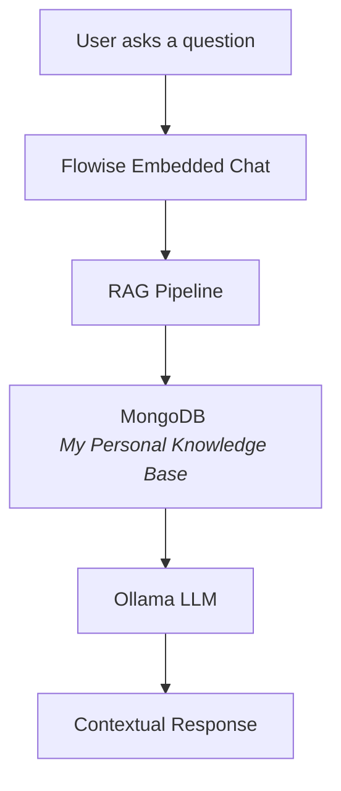

# 🧠 My AI Career Persona
An AI version of my professional identity

This project is a live AI-powered professional persona built using Retrieval-Augmented Generation (RAG).

Instead of a static resume or portfolio website, this system allows anyone to interact with an AI assistant that represents my:

- Career journey
- Skills
- Experiences
- Vision
- Projects
- Professional thinking

It answers questions about me in real-time — just like talking to my digital professional twin.

## 🎯 Purpose

Traditional resumes are static.

This project transforms my professional identity into an interactive AI system that can:

✔ Explain my experience

✔ Describe my projects

✔ Share my career vision

✔ Discuss my skills

✔ Answer behavioral questions

This makes my portfolio:

👉 Dynamic

👉 Conversational

👉 Future-ready

## 🧬 What Makes It Unique?

This is not a normal chatbot.

It is trained only on:

- My resume
- My experiences
- My projects
- My long-term career vision
- My learning mindset
- My professional philosophy

It behaves like: My AI Career Persona.

## ⚙️ How It Works

The system follows a Retrieval-Augmented Generation (RAG) workflow to provide context-aware answers based on your personal data:

1.  **User Inquiry**: User asks a question via the chatbot. 
2.  **Vector Search**: The query retrieves relevant documents from **MongoDB** (Personal Knowledge Base). 
3.  **Context Injection**: The retrieved data is passed as context to the LLM model.
4.  **Generation**: A contextual, accurate response is generated.
   
## Project Workflow

## Tech Stack

- Component	Purpose
- Flowise	AI Orchestration
- MongoDB	Personal Knowledge Base
- Ollama	LLM Response Engine
- Cloudflare Tunnel	Public Access

## 🌐 Deployment Approach

Instead of building a custom website, this project uses:

👉 Flowise Native Embedded Chat Interface

This enables:

- Lightweight deployment
- Fast prototyping
- Easy integration
- Public accessibility

## 🧠 What This AI Can Answer Sample questions

You can ask:

1. Tell me about your background
2. What are your key skills?
3. Explain your projects
4. What is your career goal?
5. How do you solve problems?

## 🚀 Why This Matters

In the future, professionals may not just share resumes.

They may share: AI versions of themselves.

This project is an experiment toward that future.

## 📌 Project Type

AI Infrastructure RAG + Personal Carrer Branding

## 🔮 Future Improvements

- Real-time learning updates
- Multi-language support
- Voice interaction
- Custom UI
